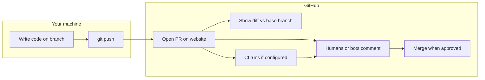
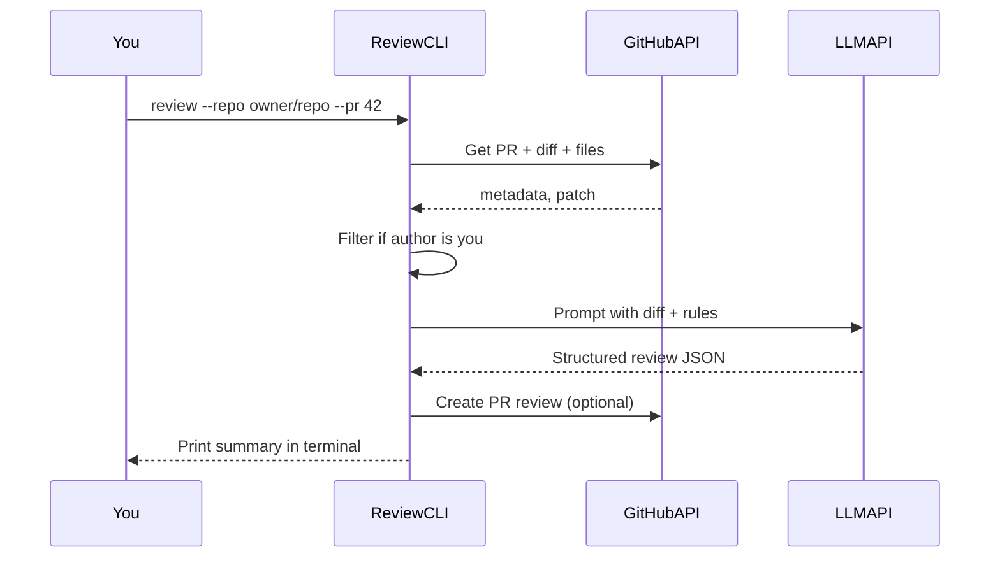
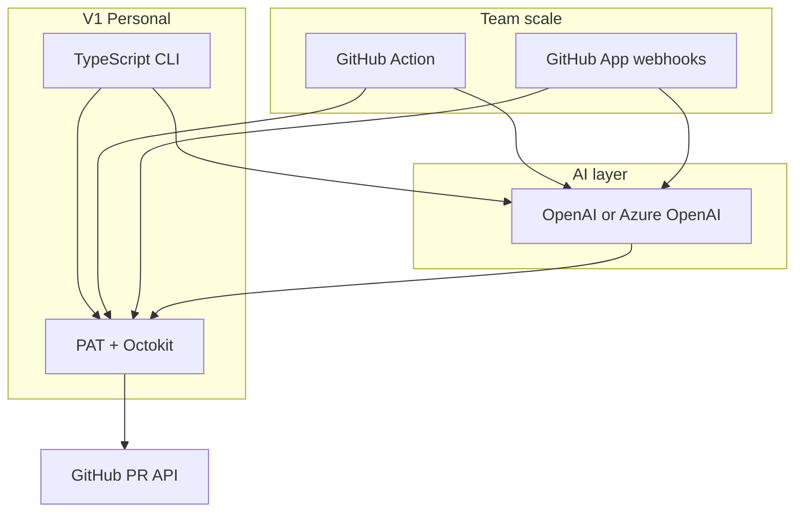

# PR Review Agent — Learning Plan

## Phase feature docs (what / why / how)

Detailed implementation guides for each phase — steps, methods, and flows:

| Phase | Doc | Status |
|-------|-----|--------|
| 1 — GitHub fetch | [phase-1-feature.md](./phase-1-feature.md) | Implemented |
| 2 — LLM review | [phase-2-feature.md](./phase-2-feature.md) | Implemented |
| 3 — Post to GitHub | [phase-3-feature.md](./phase-3-feature.md) | Implemented |
| 4 — React UI (optional) | [phase-4-feature.md](./phase-4-feature.md) | Planned |
| 5 — GitHub Action (optional) | [phase-5-feature.md](./phase-5-feature.md) | Done |

---

## How a GitHub PR works (what happens after you create one)

A **pull request (PR)** is a request to merge changes from one branch into another (usually `feature-branch` → `main`). It is not magic automation — it is a **conversation + checklist** on GitHub until someone merges.



**Step by step (typical team flow):**

1. **Branch** — You create a branch locally (`git checkout -b fix-login`) and commit changes.
2. **Push** — You push the branch to GitHub (`git push -u origin fix-login`).
3. **Open PR** — On GitHub you click “Compare & pull request”, choose **base** (e.g. `main`) and **compare** (your branch), add title/description, and create the PR.
4. **Diff is computed** — GitHub shows every file/line that would change if merged. Reviewers read this diff, not your whole repo.
5. **Checks run (optional)** — If the repo has **GitHub Actions** or other CI, workflows often run on `pull_request` (build, tests, lint). Results show as green/red on the PR.
6. **Review** — Teammates (or tools) leave:
   - **Comments** on the PR conversation
   - **Line comments** on specific code lines
   - **Reviews**: *Comment*, *Approve*, or *Request changes*
7. **You update the PR** — You push more commits to the same branch; the PR **updates automatically** (diff and checks re-run).
8. **Merge** — When policies are met (approvals, green CI), someone clicks **Merge**; your commits land on the base branch.

**Where your PR review agent fits:** It acts like an extra reviewer between steps 4–6 — it reads the **diff via API**, sends it to an LLM, and either prints feedback (CLI) or posts a **review comment** on the PR (with `--post`). It does **not** replace human approval unless your team chooses to treat it that way.

---

## User stories

### Story 1 — Trainee reviews own PR before asking humans (v1)

**As a** trainee software engineer  
**I want to** run a command against a PR I just opened  
**So that** I get AI feedback on bugs, missing tests, and clarity before my senior spends time on it.

**Acceptance criteria:**

- Command: `review --repo myorg/myapp --pr 42`
- Agent only runs if I am the PR author (or I pass an explicit override flag later)
- Output appears in terminal; with `--post`, a summary comment appears on the PR
- I can read the review on GitHub and fix issues, then push — PR updates, I can run the agent again

### Story 2 — Learn how GitHub and APIs connect (Phase 1)

**As a** learner  
**I want to** run `--dry-run` and see PR title, author, files, and diff size without calling the LLM  
**So that** I understand what data the agent uses before adding AI.

### Story 3 — Safe first post to GitHub (Phase 3)

**As a** developer  
**I want** reviews to be opt-in (`--post`) and avoid duplicate spam  
**So that** I do not annoy reviewers with ten identical bot comments on every push.

### Story 4 — Optional dashboard (Phase 4)

**As a** user who prefers UI  
**I want** a small React page listing my open PRs with a “Review” button  
**So that** I do not memorize CLI flags.

### Story 5 — Teammates use the same agent (future, not v1)

**As a** repository contributor  
**I want** the PR review agent to run when I open or update a PR  
**So that** everyone gets consistent automated feedback, not only the person who built the CLI.

**Requires:** shared automation (see “Who can use the agent” below) — not the personal-token CLI alone.

---

## Who can use the PR review agent?

| Mode | Who can use it | Whose PRs get reviewed | v1? |
|------|----------------|------------------------|-----|
| **Personal CLI** (your plan) | Only **you**, on your laptop, with your `GITHUB_TOKEN` | Default: **only PRs you authored** | Yes — start here |
| **Each teammate runs their own CLI** | Anyone who clones the repo and sets their own token | Each person’s **own** PRs (author filter per user) | Easy extension — no shared infra |
| **GitHub Action in the repo** | **Everyone** who opens a PR in that repo (automatic) | All PRs (or filter by label/author in workflow) | Phase 5 — best for “others in my repo” |
| **GitHub App + webhook server** | Org/repo installs the app; events trigger your server | Configurable (all PRs, specific repos) | Advanced — production teams |
| **Hosted web app (React + API)** | Teammates log in with GitHub OAuth | Per-user or per-repo rules | Phase 4+ |

**Direct answer to your question:**  
- **v1 (manual CLI + your PAT):** **No** — other people do not automatically get reviews when they create PRs. Only **you** can run the tool, and only while your token and machine are set up.  
- **Yes, others can use it later** if you add one of:
  1. **GitHub Action** checked into the repo (`.github/workflows/pr-review.yml`) — runs on `pull_request` for every contributor; or  
  2. **Documented CLI** — each teammate installs Node, adds their own token, runs `npm run review` on their PR; or  
  3. **Shared service** — GitHub App or internal API everyone triggers from a UI.

**Recommendation for a trainee:** Build **Story 1** for yourself first. When that works, add a **GitHub Action** (Phase 5) so the whole repo benefits — that is the usual path from “my learning project” to “team tool.”

**Permissions note:** Posting a review on someone else’s PR requires a token (or bot account) with **write access to pull requests** on that repo. A personal PAT works if you are a collaborator; a **GitHub App** is the right long-term identity for a bot named `pr-review-agent`.

---

## Is it possible?

**Yes.** GitHub exposes everything you need:

- Read PR metadata, changed files, and diff via the [Pull Requests REST API](https://docs.github.com/en/rest/pulls/pulls) or [GraphQL API](https://docs.github.com/en/graphql)
- Post feedback as a [pull request review](https://docs.github.com/en/rest/pulls/reviews) (summary comment + optional line comments)

You can restrict reviews to **PRs you authored** by checking `pull_request.user.login` against your GitHub username before calling the LLM or posting a review.



---

## Recommended stack (best fit for the problem — not your résumé)

If language familiarity is ignored, this is the stack most teams would pick for a GitHub PR review agent and why.

### Primary recommendation

| Layer | Choice | Why this wins for PR review |
|-------|--------|-----------------------------|
| **Language** | **TypeScript on Node.js 20+** | Largest GitHub automation ecosystem: [Octokit](https://github.com/octokit/rest.js), official Actions examples, and most open-source PR bots (CodeRabbit-style tools, probot lineage) are TS/JS. One language covers CLI, GitHub Action, and webhook API. |
| **GitHub access (v1)** | **Fine-grained PAT** + `@octokit/rest` | Fastest path to read diffs and post reviews; no app registration. |
| **GitHub access (team/production)** | **GitHub App** (same TS codebase, `@octokit/app`) | Proper bot identity, install per repo/org, webhook-driven reviews for all contributors. Industry standard for “bot on PR.” |
| **Trigger (v1)** | **CLI** (`tsx` / `node`) | Manual, debuggable, no hosting cost. |
| **Trigger (team)** | **GitHub Action** (workflow runs your TS script) | Native to PR lifecycle; secrets in repo; every contributor gets reviews without running your laptop. |
| **LLM** | **Direct HTTP** to **OpenAI** or **Azure OpenAI** | PR review is “big prompt + structured JSON out” — no agent framework required. Use a strong general model (e.g. GPT-4o class) with **JSON schema / structured outputs** and **Zod** validation. |
| **Orchestration** | **Plain functions** (no LangChain/LlamaIndex in v1) | Fewer moving parts; you see exactly what goes to the model. Add RAG or tools only if you need repo-wide context beyond the diff. |
| **UI (optional)** | **Next.js** or **Vite + React** + thin API | UI is optional; if added, keep review logic in shared TS modules used by CLI and API. |
| **Database (optional)** | **SQLite** or **Postgres** | Only if storing review history, deduplication by commit SHA, or analytics — skip for v1. |



### Runner-up: Python

| Use Python if… | Trade-off |
|----------------|-----------|
| You already standardize on FastAPI for internal tools | [PyGithub](https://github.com/PyGithub/PyGithub) / `httpx` are fine; fewer copy-paste PR-bot examples than TS |
| You plan heavy ML later (embeddings, custom models) | GitHub Actions and Apps are still often TS in polyglot orgs — two runtimes to maintain |

**Verdict:** Python is a solid **#2**; not the default for GitHub-centric bots.

### Acceptable but weaker defaults for this use case

| Stack | When it makes sense | Why not default for PR bots |
|-------|---------------------|------------------------------|
| **.NET (C#)** | Company is all-Azure, API in ASP.NET already | Smaller GitHub bot community; Octokit.NET works but fewer tutorials for Apps/Actions |
| **Go** | High-volume webhook service, ops loves single binary | More boilerplate for JSON/LLM ergonomics; overkill for a learning v1 |
| **Java/Kotlin** | Enterprise GitHub Enterprise Server shop | Heavy setup for a small agent |
| **Cursor SDK** | You want IDE-grade repo exploration in cloud CI | Hides the learning loop; adds vendor lock-in and API-key model — use **after** you own diff → LLM → comment |

### What to avoid in v1

- **Heavy agent frameworks** (LangChain, AutoGPT-style loops) — PR diff review is one-shot, not multi-tool reasoning.
- **Hosting a server first** — CLI + Action gets you 90% without Railway/Fly ops.
- **GitHub App before CLI works** — App auth and webhooks add complexity; earn it in Phase 5.

### Stack by deployment stage (technology-agnostic path)

| Stage | Stack |
|-------|--------|
| Learn + solo | TS CLI + PAT + OpenAI/Azure OpenAI |
| Team auto-review | Same TS core + GitHub Action + repo secrets |
| Org / many repos | TS GitHub App + webhook handler (Railway/Fly/Azure Functions) |
| Optional UI | Next.js calling same `review` package |

### Your background (secondary)

React, Node, and C# all map cleanly: **Node/TS is the default** above; React fits an optional dashboard; **C# only if** you deliberately want .NET practice instead of the path of least resistance for GitHub tooling.

---

## What the agent should do (v1 scope)

Keep the first version small and educational:

1. **Input:** `owner/repo` + PR number (or PR URL)
2. **Fetch:** title, body, base branch, file list, unified diff (truncate/chunk if too large)
3. **Review:** LLM returns structured JSON, e.g.:
   - `summary` (2–4 sentences)
   - `risks` (bugs, security, breaking changes)
   - `suggestions` (actionable improvements)
   - `lineComments` (optional: path + line + comment)
4. **Output:** print to terminal first; then **opt-in** `--post` to create a GitHub PR review
5. **Guardrail:** skip or warn if PR author ≠ your GitHub user

**Review focus (good for trainees):** correctness, tests missing, error handling, naming, security (secrets, SQL injection), and “would I approve this?” — not style nitpicks only.

---

## Project structure (current)

```
pr-review-agent/
  docs/
    PLAN.md          # This file — learning plan and progress checklist
  src/
    cli.ts           # Entry: parse args, orchestrate (Phase 1)
    config.ts        # Env: GITHUB_TOKEN, GITHUB_USERNAME
    github.ts        # Octokit: get PR, diff, files, author filter
    review.ts        # (Phase 2) Build prompt, call LLM, parse JSON
  .env.example
  package.json
  tsconfig.json
  README.md
```

**Environment variables:**

- `GITHUB_TOKEN` — fine-grained PAT: Contents (read), Pull requests (read + write if posting)
- `GITHUB_USERNAME` — your login for “only my PRs”
- `AZURE_OPENAI_*` or `OPENAI_API_KEY` — model deployment / API key (Phase 2+)

---

## Implementation phases

### Phase 1 — GitHub only (no AI) ✅ Done

**Goal:** Prove you can talk to GitHub.

- Create a GitHub fine-grained PAT scoped to one test repo
- CLI command: `npm run review -- --repo owner/repo --pr N --dry-run`
- Log: PR title, author, changed files, diff size
- Exit if author is not you

**Learn:** REST auth, PR object model, rate limits, diff size limits.

### Phase 2 — LLM review (terminal output) ← You are here

**Goal:** Complete the agent loop without posting publicly yet.

- Build a system prompt: “You are a senior reviewer… output JSON only…”
- Send truncated diff (e.g. cap ~80k chars; split by file if needed)
- Parse JSON with `zod` validation; retry once if malformed
- Print formatted review in the terminal

**Learn:** prompt design, structured output, token budgeting, handling large PRs.

### Phase 3 — Post review to GitHub

**Goal:** Feedback appears on the PR like a human reviewer.

- `POST /repos/{owner}/{repo}/pulls/{pull_number}/reviews` with `event: "COMMENT"` and body = summary
- Optional: map `lineComments` to `comments[]` with `path`, `line`, `body` (line numbers must match the diff side GitHub expects — common beginner bug; validate on a small PR first)

**Learn:** review API semantics, idempotency (don’t spam duplicate reviews — add `--force` or check last review timestamp).

### Phase 4 (optional) — React dashboard

- Small **Express** or **Next.js API route** wrapping the same `review.ts` / `github.ts`
- UI: list open PRs authored by you → “Review” button → show result
- Reuse all business logic from the CLI; no duplicate AI logic in the frontend

### Phase 5 (optional) — Automation for the whole repository

**Goal:** When **any teammate** opens or updates a PR, they get a review without running your laptop CLI.

- Add [`.github/workflows/pr-review.yml`](../.github/workflows/pr-review.yml) triggered on `pull_request` (`opened`, `synchronize`)
- Workflow checks out code, runs the same `review.ts` logic, posts comment via `GITHUB_TOKEN` provided by Actions
- Filters (choose one): all PRs, only PRs with label `ai-review`, or skip dependabot PRs
- Store LLM API key in **repository secrets** (admin adds once; contributors do not see the key)
- Optional: `workflow_dispatch` so anyone can manually re-run review from the Actions tab

**Learn:** CI/CD, secrets, bot identity (`github-actions[bot]`), repo-level vs user-level tools.

**Later:** GitHub App for org-wide install across many repos — only if you outgrow a single-repo Action.

---

## Key technical pitfalls (plan for these early)

| Pitfall | Mitigation |
|---------|------------|
| Diff too large for model context | Truncate per file; summarize file list first; skip generated/lock files |
| Wrong line numbers in comments | Use diff parsing or post summary-only reviews first |
| Token cost | `--dry-run`, smaller model for first pass, max files limit |
| Posting duplicate reviews | Default to print-only; `--post` flag; store last reviewed SHA in a local `.cache` file |
| Secrets in repo | Never log full diff in CI logs; use `.env` locally |

---

## Learning resources (in order)

1. [GitHub REST — Get a pull request](https://docs.github.com/en/rest/pulls/pulls#get-a-pull-request)
2. [GitHub REST — Create a review](https://docs.github.com/en/rest/pulls/reviews#create-a-review-for-a-pull-request)
3. [Octokit.js](https://github.com/octokit/rest.js)
4. OpenAI / Azure OpenAI “JSON mode” or structured outputs for reliable parsing

---

## Success criteria (you’ll know v1 works when…)

- You run one command against a real PR you opened
- Terminal shows a structured review you find useful
- With `--post`, a comment appears on that PR on GitHub
- Non-your PRs are rejected with a clear message

---

## Suggested first PR to test on

Use a **small PR** (1–3 files, < 500 lines changed) in a repo you own or a fork — avoids diff/token issues while you debug line comments.

---

## Progress checklist

Track implementation status against the plan. Update this section as you complete work.

### Phase 1 — GitHub only (no AI)

- [x] Node.js 20+ TypeScript project scaffolded (`package.json`, `tsconfig.json`)
- [x] `.env.example` with `GITHUB_TOKEN` and `GITHUB_USERNAME`
- [x] `src/config.ts` — load and validate env vars, parse `owner/repo`
- [x] `src/github.ts` — Octokit client, fetch PR metadata
- [x] `src/github.ts` — list changed files via `pulls.listFiles`
- [x] `src/github.ts` — fetch unified diff via `mediaType: diff`
- [x] `src/github.ts` — author guard (`assertAuthorIsUser`)
- [x] `src/cli.ts` — `--repo`, `--pr`, `--dry-run`, `--allow-any-author` flags
- [x] `src/cli.ts` — print PR summary (title, author, files, diff size)
- [x] Large-diff warning when diff exceeds 100k chars
- [x] `npm run typecheck` passes
- [x] **Manual test:** run against a real PR you opened with `--dry-run`
- [ ] **Manual test:** confirm non-author PR is rejected without `--allow-any-author`

### Phase 2 — LLM review (terminal output)

- [x] Add LLM env vars to `.env.example` (`OPENAI_API_KEY`)
- [x] Add `zod` dependency for JSON validation
- [x] Create `src/review.ts` — system prompt and review schema
- [x] Create `src/review.ts` — OpenAI HTTP call
- [x] Implement diff truncation (~80k chars; skip lock files)
- [x] Parse and validate LLM JSON output with Zod; retry once on failure
- [x] Wire CLI to call LLM when `--no-dry-run` is passed
- [x] Print formatted review in terminal (`summary`, `risks`, `suggestions`)
- [ ] **Manual test:** run review on a small PR and verify useful output

### Phase 3 — Post review to GitHub

- [x] Extend PAT scopes in docs — Pull requests (Write) for posting
- [x] Add `--post` flag to CLI
- [x] Implement `postPrReview()` in `src/github.ts`
- [x] Post summary comment with `event: "COMMENT"`
- [ ] (Optional) Map `lineComments` to GitHub review comment format
- [x] Add deduplication — skip if same commit SHA already reviewed (`.cache` file)
- [x] Add `--force` flag to override deduplication
- [ ] **Manual test:** post review on a small test PR on GitHub

### Phase 4 (optional) — React dashboard

- [ ] Choose stack (Express or Next.js API route)
- [ ] Reuse `github.ts` and `review.ts` from shared modules
- [ ] List open PRs authored by current user
- [ ] “Review” button triggers same logic as CLI
- [ ] Display review result in UI

### Phase 5 (optional) — GitHub Action for team

- [ ] Create `.github/workflows/pr-review.yml`
- [ ] Trigger on `pull_request` (`opened`, `synchronize`)
- [ ] Store LLM API key in repository secrets
- [ ] Add PR filters (label, skip dependabot, etc.)
- [ ] Optional `workflow_dispatch` for manual re-run

### Documentation

- [x] `README.md` — Phase 1 setup and run instructions
- [x] `docs/PLAN.md` — full learning plan (this file)
- [ ] `README.md` — Phase 2/3 commands and LLM setup
- [ ] `README.md` — PAT scope table for read vs write
- [ ] `README.md` — user stories and pitfalls for trainees

### v1 success criteria

- [ ] Run one command against a real PR you opened
- [ ] Terminal shows a structured review you find useful
- [ ] With `--post`, a comment appears on that PR on GitHub
- [ ] Non-your PRs are rejected with a clear message

---

## What to do next

1. **Test Phase 3** — upgrade PAT to Pull requests (Write), then run:
   ```bash
   npm run review -- --repo owner/repo --pr N --review --post
   ```
2. **Optional:** Phase 4 UI or Phase 5 GitHub Action.
