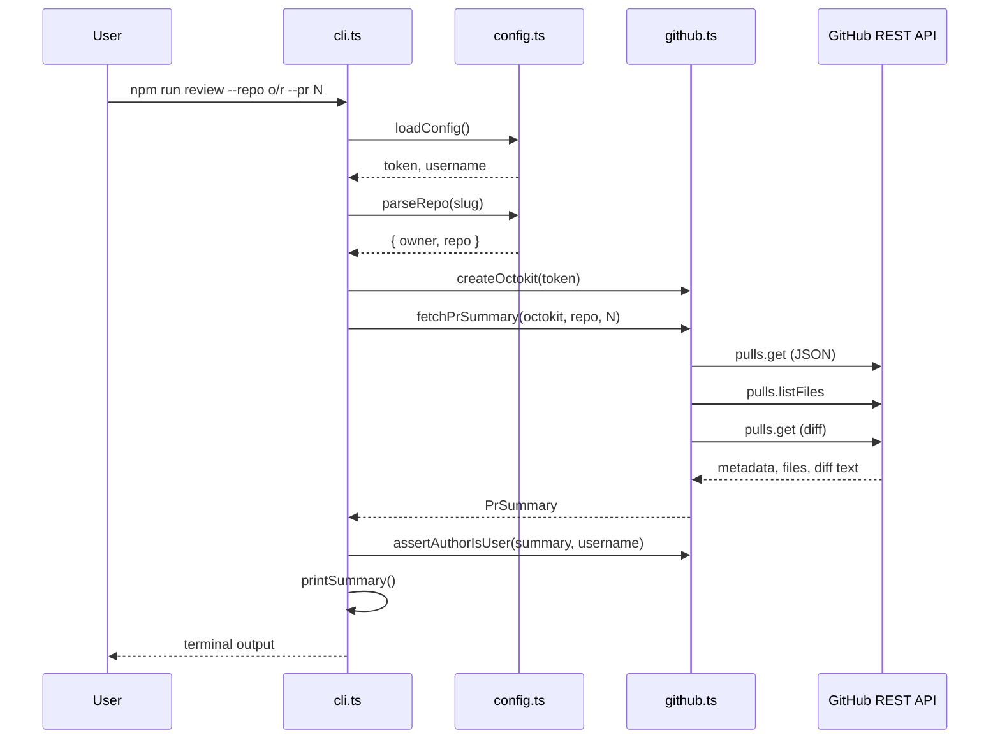

# Phase 1 — GitHub fetch (no AI)

**Status:** Implemented  
**Goal:** Prove your CLI can authenticate with GitHub and read everything needed for a future AI review — without calling an LLM or posting comments.

---

## What this phase does

| Capability | Description |
|------------|-------------|
| Load secrets | Read `GITHUB_TOKEN` and `GITHUB_USERNAME` from `.env` |
| Parse repo slug | Turn `owner/repo` into API parameters |
| Fetch PR data | Title, author, branches, stats, file list, diff size |
| Author guard | Refuse PRs you did not open (unless overridden) |
| Terminal output | Print a human-readable summary (`--dry-run`) |

**Command:**

```bash
npm run review -- --repo owner/repo --pr 42 --dry-run
```

---

## Why this phase exists first

1. **Isolate GitHub from AI** — If the CLI cannot fetch a PR, adding an LLM will only hide the real problem (bad token, wrong repo, missing permissions).
2. **Learn the PR data model** — You see exactly what GitHub returns before paying for tokens or posting public comments.
3. **Validate least-privilege token** — Read-only PAT is enough; you confirm scopes work before Phase 3 needs Write.
4. **Safe default** — `--dry-run` means zero side effects on GitHub and zero LLM cost.

---

## How it works (end-to-end flow)



---

## Files and responsibilities

| File | Role |
|------|------|
| `src/cli.ts` | Parse CLI flags, orchestrate flow, print output |
| `src/config.ts` | Load env vars, parse `owner/repo` |
| `src/github.ts` | All GitHub API calls and author check |
| `.env` | Secrets (not committed) |

---

## Step-by-step: what happens when you run the command

### Step 1 — Commander parses arguments (`cli.ts`)

**What:** Reads `--repo`, `--pr`, `--dry-run`, `--allow-any-author`.

**Why:** Separates “user input” from “business logic” so `github.ts` stays testable and reusable in Phase 5 (GitHub Action).

**How:**

- `commander` validates `--pr` is a positive integer.
- `--dry-run` defaults to `true` in Phase 1 so you never accidentally call AI or post.

---

### Step 2 — Load configuration (`config.ts` → `loadConfig`)

**What:** Reads `GITHUB_TOKEN` and `GITHUB_USERNAME` from environment (via `dotenv`).

**Why:**

- Token proves identity to GitHub on every request.
- Username enables “only review my PRs” without extra API calls.

**How:**

```typescript
loadConfig(): { token: string; username: string }
```

- Trims whitespace from env values.
- Throws clear errors if either variable is missing.

**Fails when:** `.env` missing or empty → immediate error before any network call.

---

### Step 3 — Parse repository slug (`config.ts` → `parseRepo`)

**What:** Converts `vieronicka/PR-Review-Bot` → `{ owner: "vieronicka", repo: "PR-Review-Bot" }`.

**Why:** GitHub REST paths need `owner` and `repo` as separate parameters, not one string.

**How:**

```typescript
parseRepo(slug: string): RepoRef
```

- Splits on `/`, expects exactly two non-empty parts.
- Throws if format is wrong (e.g. `myrepo` without owner).

---

### Step 4 — Create API client (`github.ts` → `createOctokit`)

**What:** Builds an authenticated Octokit client.

**Why:** Octokit wraps GitHub REST: handles base URL, auth header, pagination, and response typing.

**How:**

```typescript
createOctokit(token: string): Octokit
```

- Passes `auth: token` → sends `Authorization: Bearer <token>` on each request.

---

### Step 5 — Fetch PR summary (`github.ts` → `fetchPrSummary`)

**What:** Three API calls, merged into one `PrSummary` object.

**Why each API call:**

| API | What | Why |
|-----|------|-----|
| `GET /repos/{owner}/{repo}/pulls/{pull_number}` | PR metadata | Title, author, branches, line counts |
| `GET .../pulls/{pull_number}/files` | Per-file stats | See what changed without parsing full diff |
| `GET .../pulls/{pull_number}` with `Accept: application/vnd.github.diff` | Unified diff text | Phase 2 sends this to the LLM; Phase 1 only measures size |

**How:**

```typescript
fetchPrSummary(octokit, repo, prNumber): Promise<PrSummary>
```

1. `octokit.pulls.get` → JSON PR object.
2. `octokit.pulls.listFiles` → up to 100 files (`per_page: 100`).
3. `octokit.pulls.get` with `mediaType: { format: "diff" }` → raw diff string.
4. Maps API fields into `PrSummary` (does not return full diff text in Phase 1 — only `diffCharCount`).

**Note:** Large PRs with >100 files are truncated by GitHub pagination; Phase 2 may add paging.

---

### Step 6 — Author guard (`github.ts` → `assertAuthorIsUser`)

**What:** Compares PR author login to `GITHUB_USERNAME`.

**Why:**

- v1 is a **personal learning tool** — you review your own PRs before asking humans.
- Prevents accidentally reviewing someone else’s PR with your token.

**How:**

```typescript
assertAuthorIsUser(summary, expectedUsername): void
```

- Case-insensitive comparison.
- Throws with a clear message naming actual vs expected author.

**Bypass:** `--allow-any-author` for testing (e.g. sample PRs in docs).

---

### Step 7 — Print summary (`cli.ts` → `printSummary`)

**What:** Formats `PrSummary` for the terminal.

**Why:** Human-readable output before JSON/AI formatting in Phase 2.

**How:**

- Prints title, URL, state, author, base/head branches, stats.
- Lists each changed file with status (`added`, `modified`, `removed`, etc.).
- If `diffCharCount > 100_000`, warns that Phase 2 must truncate.

---

## Methods reference

### `src/config.ts`

| Method | Input | Output | Purpose |
|--------|-------|--------|---------|
| `loadConfig()` | `process.env` | `{ token, username }` | Validate and return secrets |
| `parseRepo(slug)` | `"owner/repo"` | `RepoRef` | Split slug for API paths |

### `src/github.ts`

| Method | Input | Output | Purpose |
|--------|-------|--------|---------|
| `createOctokit(token)` | PAT string | `Octokit` | Authenticated client |
| `fetchPrSummary(octokit, repo, prNumber)` | Client + repo + PR # | `PrSummary` | Fetch metadata, files, diff size |
| `assertAuthorIsUser(summary, username)` | `PrSummary` + login | `void` (throws) | Enforce “my PRs only” |

### `src/cli.ts`

| Function | Purpose |
|----------|---------|
| `main()` | Orchestrate load → fetch → guard → print |
| `printSummary(summary, dryRun)` | Terminal formatting |

---

## Types

### `RepoRef`

```typescript
{ owner: string; repo: string }
```

**Why:** Type-safe repo identification passed into all GitHub functions.

### `PrSummary`

```typescript
{
  number, title, state, author,
  baseBranch, headBranch, url, body,
  changedFiles, additions, deletions,
  files: [{ filename, status, additions, deletions, changes }],
  diffCharCount: number
}
```

**Why:** One object carries everything Phase 2 needs without re-fetching from GitHub.

---

## CLI flags

| Flag | Default | What | Why |
|------|---------|------|-----|
| `--repo` | required | `owner/repo` | Target repository |
| `--pr` | required | PR number | Which pull request |
| `--dry-run` | `true` | Fetch only, no AI/post | Safe learning mode |
| `--allow-any-author` | off | Skip author check | Test on others’ PRs |

---

## Setup checklist

- [ ] Node.js 20+
- [ ] `npm install`
- [ ] Fine-grained PAT: Contents (Read), Pull requests (Read), one repo selected
- [ ] `.env` with `GITHUB_TOKEN` and `GITHUB_USERNAME`
- [ ] Open a PR you authored in that repo
- [ ] Run: `npm run review -- --repo owner/repo --pr N --dry-run`

---

## Common errors

| Error | Cause | Fix |
|-------|-------|-----|
| Missing `GITHUB_TOKEN` | No `.env` | Copy `.env.example` → `.env` |
| 404 Not Found | Wrong repo slug or PR # | Check `owner/repo` and PR number on GitHub |
| 403 Forbidden | Token lacks permission or repo not selected | Add repo to token; enable Pull requests Read |
| Author mismatch | PR opened by someone else | Use your PR or `--allow-any-author` |

---

## What Phase 2 will add (not in Phase 1)

- Return or pass **full diff text** (not only `diffCharCount`)
- `src/review.ts` for LLM calls
- Remove “dry-run only” as the sole path when reviewing with AI

See [phase-2-feature.md](./phase-2-feature.md).
