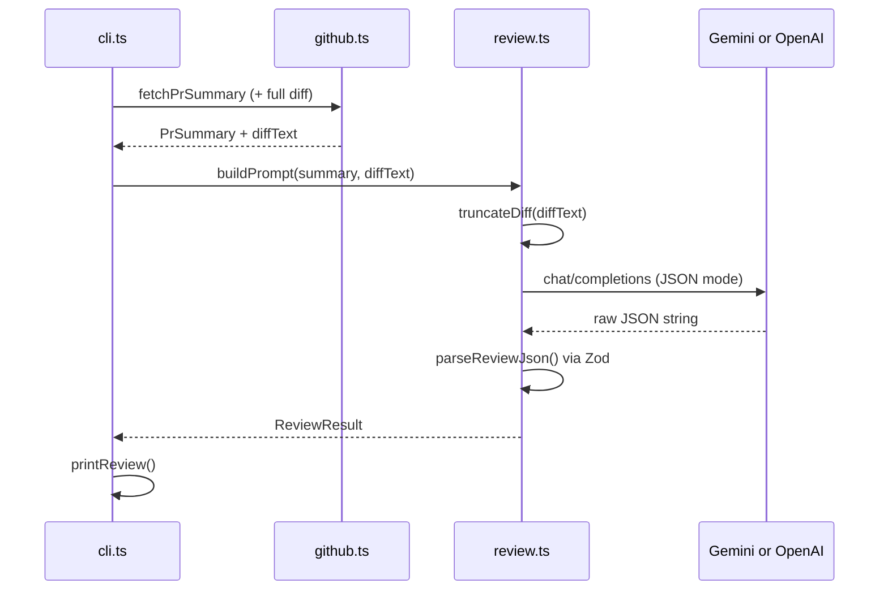

# Phase 2 — LLM review (terminal output)

**Status:** Implemented (Gemini + OpenAI)  
**Goal:** Send the PR diff to an LLM (Gemini by default, or OpenAI), get structured JSON feedback, and print it in the terminal — still **without** posting to GitHub.

---

## What this phase does

| Capability | Description |
|------------|-------------|
| Build review prompt | System + user messages with PR context and diff |
| Truncate large diffs | Stay within model context limits (~80k chars) |
| Call LLM | Gemini `generateContent` or OpenAI Chat Completions (`fetch`) |
| Validate output | Zod schema for `summary`, `risks`, `suggestions`, optional `lineComments` |
| Print review | Formatted terminal output |
| Retry once | Re-request if JSON is malformed |

**Command:**

```bash
npm run review -- --repo owner/repo --pr 42 --review
```

Also works: `--no-dry-run` (same as `--review`).

**Why `--review`:** `--dry-run` stays the default so GitHub-only fetch does not spend API credits.

---

## Why this phase exists

1. **Complete the agent loop locally** — You see AI quality before anything is public on GitHub.
2. **Learn prompt + structured output** — PR review is a single-shot task; no agent framework needed.
3. **Control cost** — Failed GitHub setup in Phase 1 would waste LLM tokens; Phase 2 runs only after fetch works.
4. **Iterate safely** — Tweak prompts and models without spamming PR comments.

---

## How it works (flow)



---

## Files

| File | Role |
|------|------|
| `src/review.ts` | `truncateDiff`, `buildPrompt`, `generateReview`, `printReview` |
| `src/github.ts` | `fetchPrSummary` returns `diffText` + `diffCharCount` |
| `src/config.ts` | `loadLlmConfig()` — `LLM_PROVIDER`, Gemini or OpenAI keys |
| `src/cli.ts` | `--no-dry-run` triggers `generateReview` |

---

## Methods reference

### `src/config.ts`

| Method | What | Why |
|--------|------|-----|
| `loadLlmConfig()` | Reads `LLM_PROVIDER` (default `gemini`) and matching API key | Switch providers without code changes |

**Env vars (Gemini — default):**

```env
LLM_PROVIDER=gemini
GEMINI_API_KEY=...
GEMINI_MODEL=gemini-2.0-flash
```

**Env vars (OpenAI):**

```env
LLM_PROVIDER=openai
OPENAI_API_KEY=sk-...
OPENAI_MODEL=gpt-4o-mini
```

---

### `src/github.ts`

| Field | What | Why |
|-------|------|-----|
| `PrSummary.diffText` | Full unified diff string | Sent to OpenAI after truncation |

---

---

### `src/review.ts`

#### `truncateDiff(diffText, maxChars?)`

**What:** Cap diff length; optionally skip lockfiles, binaries, generated paths.

**Why:**

- Models have context limits; huge PRs would fail or cost too much.
- `package-lock.json` diffs rarely help human-style review.

**How:** Max 80,000 characters; split on `diff --git`; skips `package-lock.json`, `yarn.lock`, etc.; appends omission note.

---

#### `buildPrompt(summary, diffText)`

**What:** Assemble system + user messages for the chat API.

**Why:** Consistent review focus (bugs, tests, security) across runs.

**How:** Returns `{ system, user }` for Chat Completions — PR metadata + truncated diff in user message.

---

#### `ReviewSchema` (Zod)

**What:** Validate LLM output shape.

**Why:** Models sometimes return markdown fences or extra fields; Zod catches that before printing.

**Shape:**

```typescript
{
  summary: string;           // 2–4 sentences
  risks: string[];           // bugs, security, breaking changes
  suggestions: string[];     // actionable improvements
  lineComments?: Array<{     // optional, Phase 3 may post these
    path: string;
    line: number;
    body: string;
  }>;
}
```

---

#### `callLlm(llm, system, user)`

**What:** Dispatches to `callGemini` or `callOpenAi` based on `llm.provider`.

**Why:** One code path for Phase 2; swap provider via `.env` only.

#### `generateReview(summary, llm)`

**What:** Orchestrate truncate → prompt → call → parse → retry.

**Why:** One function for CLI and later GitHub Action to reuse.

**How:** `truncateDiff` → `buildPrompt` → `callLlm` → Zod parse; one retry on parse failure.

- **Gemini:** `POST generativelanguage.googleapis.com/.../generateContent` with `responseMimeType: application/json`
- **OpenAI:** `POST api.openai.com/v1/chat/completions` with `response_format: json_object`

---

#### `printReview(review)`

**What:** Format `ReviewResult` for terminal.

**Why:** Readable output for trainees; mirrors what will later be posted to GitHub.

---

### `src/cli.ts`

| Flag / behavior | What | Why |
|-----------------|------|-----|
| `--dry-run` (default) | Phase 1 summary only | No OpenAI cost |
| `--review` or `--no-dry-run` | Calls `generateReview` + `printReview` | Phase 2 |
| Author guard | Always before LLM | Don’t spend tokens on others’ PRs |

---

## Step-by-step: planned user journey

### Step 1 — Fetch (same as Phase 1, extended)

**What:** Get `PrSummary` + full diff text.

**Why:** LLM cannot review code it never sees.

---

### Step 2 — Truncate diff

**What:** Reduce diff to fit context window.

**Why:** A 5,000-line PR would exceed token limits and increase cost.

**Fails gracefully when:** Entire diff is one huge file → summarize file list + partial diff + omission note.

---

### Step 3 — Call LLM

**What:** Send prompt; receive JSON string.

**Why:** Structured output enables reliable parsing and Phase 3 posting.

---

### Step 4 — Validate with Zod

**What:** `ReviewSchema.parse(JSON.parse(raw))`

**Why:** Catch hallucinated structure before showing or posting review.

---

### Step 5 — Print to terminal

**What:** Sections: Summary, Risks, Suggestions, (optional) Line comments.

**Why:** You judge quality before `--post` in Phase 3.

---

## Dependencies

| Package | Why |
|---------|-----|
| `zod` | Runtime validation of LLM JSON |

Uses native `fetch` (no `openai` npm package).

---

## Review focus (prompt guidelines)

**What the model should prioritize:**

- Correctness and bugs
- Missing tests
- Error handling
- Security (secrets, injection)
- “Would I approve this?”

**What to de-prioritize:**

- Pure formatting/style nitpicks unless they harm readability

**Why:** Matches trainee learning goals in [PLAN.md](./PLAN.md), not a linter replacement.

---

## Pitfalls and mitigations

| Pitfall | Mitigation |
|---------|------------|
| Diff too large | `truncateDiff`, skip lockfiles |
| Invalid JSON from model | Zod + one retry |
| High API cost | `--dry-run` for fetch-only; cap diff size |
| Wrong file content | Use unified diff from GitHub API, not local files |

---

## Success criteria

- [ ] Run with `--no-dry-run` on a small PR you opened
- [ ] Terminal shows summary, risks, and suggestions you find useful
- [x] Malformed LLM response retries once, then fails clearly (implemented)
- [x] Large diff truncated via `truncateDiff` (implemented)

---

## What Phase 3 will add

- `--post` to publish review to GitHub
- Pull requests **Write** on PAT

See [phase-3-feature.md](./phase-3-feature.md).
