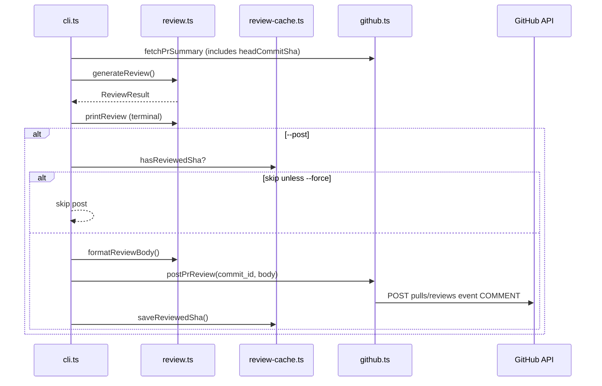

# Phase 3 — Post review to GitHub

**Status:** Implemented  
**Goal:** Publish the AI review on the pull request as a GitHub PR review — opt-in via `--post`.

---

## What this phase does

| Capability | Description |
|------------|-------------|
| `--post` flag | Creates a PR review on GitHub (implies AI review) |
| Summary comment | Posts `summary` + risks + suggestions as markdown body |
| Deduplication | Skips post if same `headCommitSha` already reviewed (`.cache/reviewed-shas.json`) |
| `--force` | Override deduplication and post again |
| Line comments | **Not posted** inline yet — shown in terminal only |

**Command:**

```bash
npm run review -- --repo owner/repo --pr 42 --review --post
```

`--post` alone also runs the AI review (you do not need `--review` separately).

---

## Prerequisites

### PAT permission

| Permission | Phase 1–2 | Phase 3 |
|------------|-----------|---------|
| Pull requests | Read | **Read and write** |

**Why Write:** `pulls.createReview` creates a review resource on the PR.

Update your token at [GitHub fine-grained tokens](https://github.com/settings/tokens?type=beta).

---

## How it works (flow)



---

## Methods reference

### `src/github.ts`

| Method | What | Why |
|--------|------|-----|
| `PrSummary.headCommitSha` | HEAD SHA of PR branch | Required `commit_id` for review API |
| `postPrReview(octokit, repo, pr, sha, body)` | `pulls.createReview` with `event: "COMMENT"` | Official PR review |

### `src/review.ts`

| Method | What | Why |
|--------|------|-----|
| `formatReviewBody(review)` | Markdown for GitHub | Summary, risks, suggestions sections |
| `printReview(review, { posted, reviewUrl })` | Terminal output | Shows post URL when applicable |

### `src/review-cache.ts`

| Method | What | Why |
|--------|------|-----|
| `hasReviewedSha(repo, pr, sha)` | Check `.cache/reviewed-shas.json` | Avoid duplicate bot comments on same commit |
| `saveReviewedSha(repo, pr, sha)` | Write timestamp after successful post | Idempotency |

### `src/cli.ts`

| Flag | What |
|------|------|
| `--post` | Run AI review and publish to GitHub |
| `--force` | Post even if SHA already in cache |
| `--review` | AI only (no post) |

---

## GitHub review `event` types

| event | Used in v1? |
|-------|-------------|
| `COMMENT` | **Yes** — neutral feedback |
| `APPROVE` | No |
| `REQUEST_CHANGES` | No |

---

## Success criteria

- [ ] Upgrade PAT to Pull requests (Write)
- [ ] Run `--review --post` on your PR
- [ ] See review on GitHub PR conversation / Files tab
- [ ] Second run on same commit skips post (unless `--force`)

---

## What Phase 4–5 add

- **Phase 4:** React UI
- **Phase 5:** GitHub Action automation

See [phase-4-feature.md](./phase-4-feature.md) and [phase-5-feature.md](./phase-5-feature.md).
