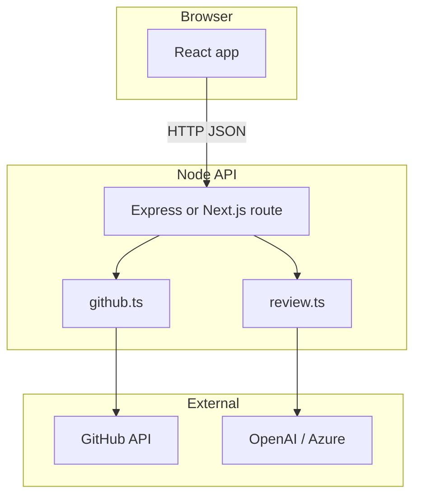

# Phase 4 — React dashboard (optional)

**Status:** Not implemented yet (optional)  
**Goal:** A small web UI to list your open PRs and trigger the same review logic as the CLI — without duplicating AI or GitHub code.

---

## What this phase will do

| Capability | Description |
|------------|-------------|
| List PRs | Show open PRs you authored in a selected repo |
| Review button | Run fetch + LLM + display result in browser |
| Optional post | Toggle to post review to GitHub (reuse Phase 3) |
| Shared core | Import `github.ts` and `review.ts` from CLI package |

**Why optional:** CLI already completes v1; UI is convenience for people who prefer clicking over memorizing flags.

---

## Why this phase exists

1. **Lower friction** — See PR list and review in one place.
2. **Reuse business logic** — Proves your modules are not “CLI-only.”
3. **Learn thin API pattern** — Frontend calls backend; backend calls same functions as `cli.ts`.
4. **Portfolio/demo** — Easier to show non-technical stakeholders than a terminal.

---

## Why not build UI before Phase 2–3

| Risk | Reason |
|------|--------|
| Duplicate logic | UI might re-implement GitHub/LLM calls in React |
| Debug harder | Network + UI + AI errors stack together |
| Scope creep | v1 success criteria do not require a dashboard |

**Rule:** Phase 4 wraps existing functions; it does not replace them.

---

## How it will work (planned architecture)



---

## Planned stack options

| Option | What | Why choose |
|--------|------|------------|
| **Vite + React + Express** | Separate frontend and API | Simple mental model for learners |
| **Next.js API routes** | Single repo, API + UI | Less deployment surface |

**Recommendation for trainees:** Vite + Express — clear split between “UI” and “API that calls github.ts.”

---

## Planned API endpoints

### `GET /api/prs?repo=owner/repo`

**What:** List open PRs authored by the logged-in user.

**Why:** Populates the dashboard list.

**How (planned):**

- Use Octokit `pulls.list` with `state: open`
- Filter where `user.login === GITHUB_USERNAME`
- Return: number, title, url, created_at, head ref

---

### `POST /api/review`

**What:** Run full review for one PR.

**Why:** Same as CLI `npm run review` but triggered by button.

**Body (planned):**

```json
{
  "repo": "owner/repo",
  "pr": 42,
  "post": false
}
```

**How (planned):**

1. `fetchPrSummary` + diff
2. `assertAuthorIsUser`
3. `generateReview`
4. If `post: true` → `postPrReview`
5. Return `ReviewResult` JSON to UI

---

## Planned UI components

| Component | What | Why |
|-----------|------|-----|
| `RepoInput` | Enter `owner/repo` | User selects target repo |
| `PrList` | Table of open PRs | Pick which PR to review |
| `ReviewPanel` | Shows summary, risks, suggestions | Display `ReviewResult` |
| `PostToggle` | Checkbox “Post to GitHub” | Mirrors `--post` flag |

---

## Auth considerations

| Approach | What | Why / trade-off |
|----------|------|-----------------|
| **Server-only PAT** (v1 UI) | API uses `.env` token | Same as CLI; only you use the app locally |
| **GitHub OAuth** (later) | Each user logs in | Required for multi-user hosted app |

**Phase 4 local demo:** Server PAT is enough — matches personal CLI model.

**Why OAuth is later:** More setup (client ID, callback URL, session storage).

---

## Project layout (planned)

```
pr-review-agent/
  src/                    # existing CLI core
    github.ts
    review.ts
    cli.ts
  web/
    client/               # Vite React
      src/App.tsx
    server/               # Express
      index.ts            # imports from ../../src/
```

**Why `web/` subfolder:** Keeps CLI root clean; `npm run review` unchanged.

---

## Methods reuse map

| CLI path | API path | Shared function |
|----------|----------|-----------------|
| `loadConfig` | server startup | `loadConfig()` |
| `fetchPrSummary` | `GET/POST review` | `fetchPrSummary()` |
| `generateReview` | `POST /api/review` | `generateReview()` |
| `postPrReview` | `POST /api/review` + post | `postPrReview()` |

**Anti-pattern to avoid:** Calling OpenAI from React `useEffect` directly — exposes API keys in the browser.

---

## Step-by-step: planned user journey

1. Start API server and React dev server.
2. Enter `vieronicka/PR-Review-Bot`.
3. See list of your open PRs.
4. Click **Review** on PR #3.
5. See loading state → review appears in panel.
6. Optionally check **Post to GitHub** → calls Phase 3 path.

---

## Success criteria

- [ ] No duplicate LLM/GitHub logic in React components
- [ ] Review output matches CLI for same PR
- [ ] API keys only on server
- [ ] Post toggle behaves like `--post`

---

## What Phase 5 will add

Team-wide automation without running the UI or laptop CLI.

See [phase-5-feature.md](./phase-5-feature.md).
