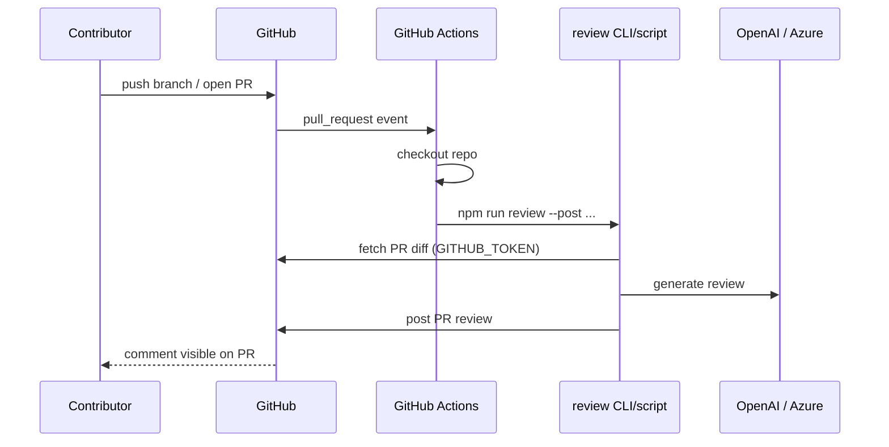

# Phase 5 — GitHub Action (team automation, optional)

**Status:** Implemented  
**Goal:** Run the same review logic automatically when anyone opens or updates a PR in the repository — without each person running the CLI on their laptop.

**Setup guide:** [phase-5-setup.md](./phase-5-setup.md)

---

## What this phase will do

| Capability | Description |
|------------|-------------|
| Workflow file | `.github/workflows/pr-review.yml` |
| Triggers | `pull_request` (`opened`, `synchronize`) |
| Shared script | Runs same `review.ts` / `github.ts` as CLI |
| Secrets | `OPENAI_API_KEY`, optional filters |
| Bot identity | Posts as `github-actions[bot]` |
| Optional manual run | `workflow_dispatch` |

**Why optional for trainees:** Phase 1–3 on your machine teaches fundamentals; Actions add CI/CD and team dynamics when you are ready.

---

## Why this phase exists

1. **Team value** — Every contributor gets reviews, not only whoever built the CLI.
2. **Consistent timing** — Review runs on every push to the PR branch.
3. **No laptop required** — Works when author is offline.
4. **Learn CI/CD** — Secrets, triggers, permissions, job logs.

---

## Why Actions instead of only CLI

| Mode | Who runs it | When |
|------|-------------|------|
| Personal CLI | You, locally | When you remember to run it |
| GitHub Action | GitHub cloud | Every PR open/update (automatic) |

**Why not skip straight to GitHub App:** Actions are simpler — no webhook server, no app registration. Enough for one repo.

**When to upgrade to GitHub App:** Many repos, org-wide install, custom bot name — post-v1.

---

## How it will work (planned flow)



---

## Planned workflow file

**Path:** `.github/workflows/pr-review.yml`

### Triggers

```yaml
on:
  pull_request:
    types: [opened, synchronize]
  workflow_dispatch:  # optional manual re-run
```

| Trigger | What | Why |
|---------|------|-----|
| `opened` | New PR created | First review |
| `synchronize` | New commits pushed | Re-review updated diff |
| `workflow_dispatch` | Manual button in Actions tab | Re-run without empty commit |

---

### Permissions (planned)

```yaml
permissions:
  pull-requests: write
  contents: read
```

**Why:**

- `pull-requests: write` — post review (Phase 3)
- `contents: read` — read repo context if needed

**Note:** `GITHUB_TOKEN` in Actions is automatic — not your personal PAT.

---

### Job steps (planned)

| Step | What | Why |
|------|------|-----|
| Checkout | `actions/checkout@v4` | Need `package.json` and `src/` |
| Setup Node | `actions/setup-node@v4` | Run TypeScript project |
| Install | `npm ci` | Reproducible dependencies |
| Run review | `npm run review -- --repo ${{ github.repository }} --pr ${{ github.event.pull_request.number }} --post` | Same entry as CLI |
| Env | `GITHUB_TOKEN: ${{ secrets.GITHUB_TOKEN }}` | Provided by Actions |
| Env | `OPENAI_API_KEY: ${{ secrets.OPENAI_API_KEY }}` | Admin adds once in repo secrets |

---

## Differences from local CLI

| Topic | Local CLI | GitHub Action |
|-------|-----------|---------------|
| Token | Your fine-grained PAT | `secrets.GITHUB_TOKEN` |
| Bot name | Your user (if using PAT) | `github-actions[bot]` |
| Author filter | `GITHUB_USERNAME` = you | May review **all** PRs or filter by label |
| Secrets | `.env` file | Repository Settings → Secrets |
| Logs | Your terminal | Actions log tab (do not log full diff) |

---

## Planned author / PR filters

**What:** Control which PRs get auto-reviewed.

**Why:** Skip dependabot, drafts, or repos that do not want AI comments.

**Options (pick one in implementation):**

| Filter | How | Why |
|--------|-----|-----|
| All PRs | No filter | Maximum coverage |
| Label `ai-review` | `if: contains(github.event.pull_request.labels.*.name, 'ai-review')` | Opt-in per PR |
| Skip dependabot | `if: github.actor != 'dependabot[bot]'` | Avoid noise on dependency PRs |
| Skip drafts | `if: !github.event.pull_request.draft` | Review when ready for humans |

---

## Planned script entry for CI

**Option A — Reuse CLI:**

```bash
npm run review -- --repo ${{ github.repository }} --pr $PR_NUMBER --post --allow-any-author
```

**Why `--allow-any-author`:** In CI, the “author” is the contributor, not the machine user. The workflow reviews **their** PR on behalf of the team.

**Option B — Dedicated `src/ci.ts`:** Thin wrapper that reads `GITHUB_EVENT_PATH` for PR number.

---

## Secrets setup (repository admin)

| Secret | What | Why |
|--------|------|-----|
| `OPENAI_API_KEY` or Azure vars | LLM access | Not visible to contributors |
| (none for GitHub) | `GITHUB_TOKEN` auto-injected | Actions built-in |

**Why repo secrets:** Contributors can trigger workflow without seeing API keys in logs or forks (with proper fork settings).

---

## Deduplication in CI

**What:** Reuse Phase 3 SHA cache or check existing reviews via API.

**Why:** `synchronize` fires on every push — without dedup, PR gets N similar comments.

**How (planned):**

- Cache in Action artifact (ephemeral) **or**
- `GET` existing reviews and skip if bot commented on same `commit_id` **or**
- Use Actions cache keyed by SHA

---

## Security pitfalls

| Pitfall | Mitigation |
|---------|------------|
| Fork PR steals secrets | Disable workflow on fork PRs or use `pull_request_target` carefully (advanced) |
| Log leaking diff | Do not `console.log` full diff in workflow |
| OpenAI key in fork | Standard: secrets not passed to fork workflows from untrusted forks |
| Over-posting | Dedup + label filter |

---

## Step-by-step: team member experience

1. Contributor opens PR on `vieronicka/PR-Review-Bot`.
2. GitHub Actions starts `pr-review` workflow.
3. Job fetches diff, calls LLM, posts comment.
4. Contributor reads bot comment, pushes fix.
5. `synchronize` triggers new review (dedup rules apply).

---

## Success criteria

- [ ] Workflow runs on PR open in test repo (verify after merging workflow to `main` and adding secrets)
- [ ] Review comment appears from `github-actions[bot]`
- [ ] New push updates review policy as designed (re-review on new SHA; dedup on same SHA)
- [ ] LLM key not exposed in logs
- [ ] Works for contributor who never cloned CLI locally

## Implemented files

| File | Purpose |
|------|---------|
| [`.github/workflows/pr-review.yml`](../.github/workflows/pr-review.yml) | `pull_request` + `workflow_dispatch` job |
| [`docs/phase-5-setup.md`](./phase-5-setup.md) | Secrets, triggers, troubleshooting |
| [`src/config.ts`](../src/config.ts) | Default `GITHUB_USERNAME` to `github-actions[bot]` in Actions |
| [`src/review.ts`](../src/review.ts) | CI footer on posted reviews |

---

## Evolution: GitHub App (post-Phase 5)

| GitHub Action | GitHub App |
|---------------|------------|
| Per-repo workflow file | Install once on org |
| `github-actions[bot]` identity | Custom bot user |
| No server | Webhook server required |
| Good for one repo learning | Good for many repos production |

**When to migrate:** Multiple repositories, custom branding, org-wide policy.

---

## Related docs

- [phase-1-feature.md](./phase-1-feature.md) — GitHub fetch
- [phase-2-feature.md](./phase-2-feature.md) — LLM review
- [phase-3-feature.md](./phase-3-feature.md) — Post to PR
- [PLAN.md](./PLAN.md) — Full learning plan and checklist
